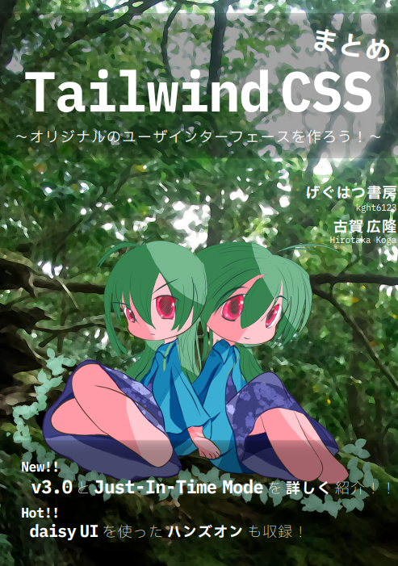
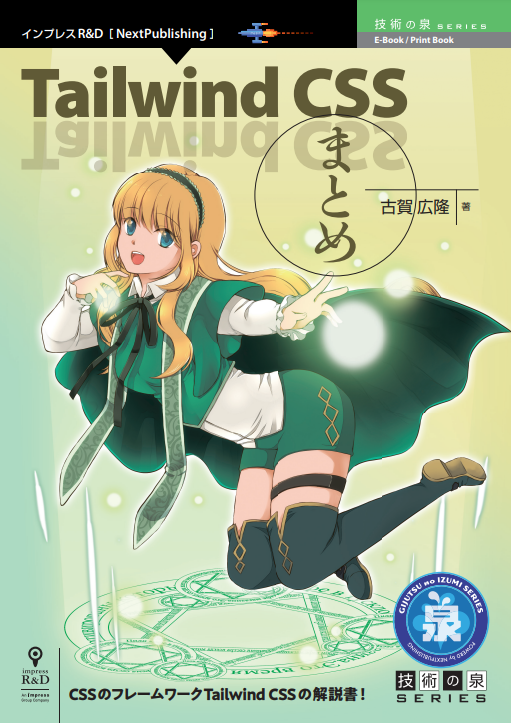

<!-- _header: - -->
Tailwind CSSの同人誌を作った話
===


技術書典で頒布した同人誌の紹介など

###### 虎の穴ラボ 古賀広隆 ([@kght6123][twitter])

[twitter]: https://twitter.com/kght6123
[github]: https://github.com/kght6123

---

## 自己紹介
古賀 広隆（@kght6123）
[Twitter][twitter]/[Github][github]

２児の父、声優の南條愛乃さん推しです。

### 得意なこと
フロントエンド周り、Javaなど


---

# あじぇんだ！

1. なぜ作ろうと思ったか？
2. どんな人に向けた本か？
3. オススメのポイントとか
4. 最後に（商業版）
5. 他の同人誌を紹介とか（とらラボの薄い本）


---

## 1. なぜ作ろうと思ったか？

最近、Tailwind CSSをよく使うなぁ
↓
公式サイトも使いやすいけど、まとめた本が欲しい
↓
Tailwind CSSを扱った本がない（当時）
↓
前々から同人誌作りたいとおもっていた


---

## 2. どんな人に向けた本か？


---

### Tailwind CSS について

- はじめての人（基本的な CSS はわかる）
- さらに詳しく知りたい人
- 最新バージョンでできることが知りたい人
- 公式サイトを読む時間がない人


---

## 3. オススメのポイントとか


---

### 1. 何度も書き直した冒頭（1章）
### 2. 設定や関数、命令をまとめた（2〜3章）
### 3. Just-in-Time Mode をまとめた（10章）
### 4. 最新の v3.0 をまとめ（13章）


---

### 1. 何度も書き直した冒頭

- 何度も公式サイトの解釈を考えて
- 作り終わった後に、もう一度、再検討して練り直し
- 新しい章をバージョンアップで追記するごとに、手を加えてます

2〜3番目に時間かけているかも


---

#### 伝えたかったこと

- 素の CSS に近い低レベルのユーティリティクラスの集まり
- ユーティリティを組み合わせて、オリジナルの部品を作れる
- 設定ファイルの変更によって、ユーティリティに高い柔軟性をもたせられる

また、書き直したいかも


---

### 2. 設定や関数、命令をまとめた

- よく使いそうな設定や関数、命令をまとめ
- 標準的な手法は網羅する
- 他 CSS ライブラリと共存やプロジェクトに合わせた設定ができるように

開発の導入部分で重要なところ！


---

### 3. Just-in-Time Mode をまとめた

- 利点や欠点、注意点をまとめ
- v2.1 で有効化する方法
- 任意の値や疑似要素のサポートをまとめ

これからのTailwind CSSで重要なところ！


---

#### 任意の値のサンプルコード

```html
<div class="
w-[762px]
h-[918px]
top-[-325px]
right-[62px]
md:top-[-400px]
md:right-[80px]
">
</div>
```

> 横幅、縦幅などに対して、任意の値を指定できる


---

### 5. 最新のv3.0をまとめ

- 破壊的な変更点、v2系からの修正方法をまとめ
- 追加された新規機能をまとめ
- 任意の値等の改善をまとめ

「#技術書典12」で大きく追記したところ！


---

#### お気に入りの機能

```html
<div class="
w-40
h-40
shadow-lg
rounded-full
bg-white
shadow-blue-400/75
"></div>
```

> 影の色（blue-400）と影の透明度（75%）を指定できる


---

#### 実行結果

背景色の黄色と影の青色が馴染む


---

## 6. さいごに

念願の技術同人誌が頒布できた。
また、機会があれば作りたいと思っています。

今回、紹介した同人誌は[Booth](https://kght6123.booth.pm/items/3039023)、[技術書典](https://techbookfest.org/product/4652225471184896)で頒布中です！




---

### 商業版について

商業版がインプレスR&D様から技術の泉シリーズとして刊行されました。
製本はカラーです、こちらもよろしければどうぞ。

[Amazon](https://www.amazon.co.jp/dp/4295600237/)




---

### 虎の穴ラボの薄い本。vol.5

去年の虎の穴ラボブログをまとめて、
技術書典12で頒布しました。
価格は無料です、こちらもよろしければどうぞ。

[技術書典](https://techbookfest.org/product/6045315293511680)


---


