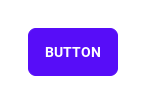
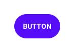
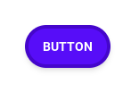
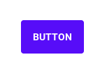
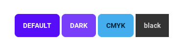
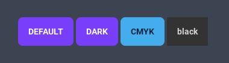
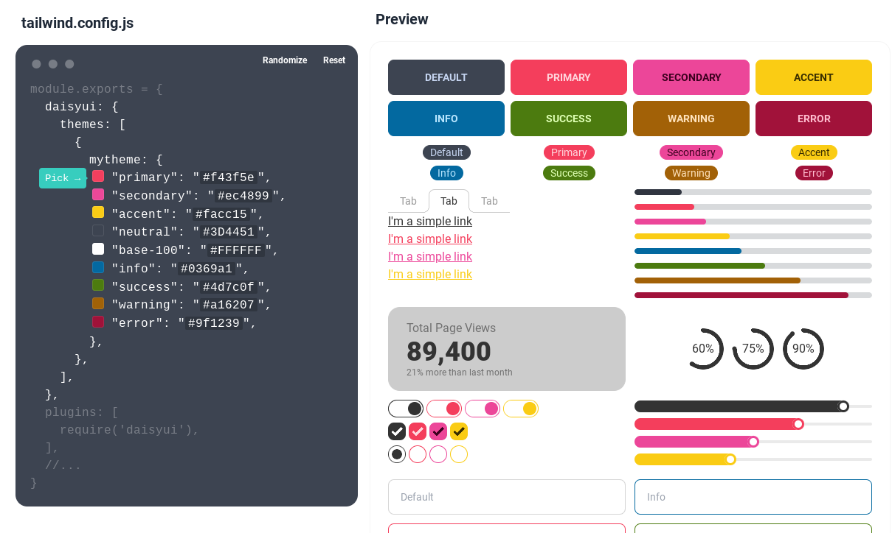
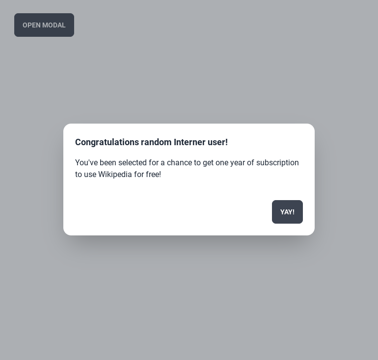

<!-- _header: - -->
daisyUIについて
===


Tailwind CSSベースのコンポーネントライブラリ！で開発を高速化！

###### 虎の穴ラボ 古賀広隆 ([@kght6123][twitter])

[twitter]: https://twitter.com/kght6123
[github]: https://github.com/kght6123

---

## 自己紹介
古賀 広隆（@kght6123）
[Twitter][twitter]/[GitHub][github]

とらのあな通販のコスト削減関連の開発に携わっています。2児の父です。

フロントエンド、サーバサイドが主な担当です。


---

# あじぇんだ！

1. [daisyUI](https://daisyui.com/)とは？
2. クリーンなHTMLになる
3. 細かいカスタマイズができる
4. テーマが使える、作れる
5. オススメのコンポーネント
6. 最後に


---

## 1. daisyUI（plugin）とは？

Tailwind CSSのコンポーネント集で、CSSの記述が楽になる下記の特徴があります。

- HTMLをきれいに保てる
- テーマ（26種類）があり、カスタマイズもできる
- ピュアCSSのコンポーネント（45個）が使える


---

## 2. クリーンなHTMLになる

- コンポーネントレベルのクラスをTailwind CSSに追加
- ユーティリティクラスのみの長いCSSになりにくい

HTMLのコードが短くてすっきりしやすくなる


---

### Tailwind CSSのユーティリティクラスのみのボタン

レスポンシブ、アニメーション、カーソル、疑似要素などさまざまなユーティリティを指定して、1つのボタンが作れる。

```html
<a class="inline-block px-4 py-3
    text-sm font-semibold text-center
    text-white uppercase transition
    duration-200 ease-in-out
    bg-indigo-600 rounded-md
    cursor-pointer
    hover:bg-indigo-700">Button</a>
<!-- 引用元: https://daisyui.com/ -->
```

---

### コンポーネントクラスのボタン

コンポーネントクラスのみで、1つのボタンが作れる。
さらに、ユーティリティクラスを追加と、カスタマイズも可能です。
（詳細は後述）

```html
<a class="btn btn-primary">Button</a>
<!-- 引用元: https://daisyui.com/ -->
```

---

## 3. 細かいカスタマイズができる！

- Tailwind CSSのユーティリティクラスを使って、細かいカスタマイズができる。
- `@apply`にdaisyUIを使ってカスタムスタイルを追加できる。
- CSS変数を利用して、daisyUIのCSS変数をカスタマイズできる。


---

### Tailwind CSSのユーティリティクラスを使う

```html
<a class="btn btn-primary">Button</a>
```
↓
```html
<a class="btn btn-primary rounded-full">Button</a>
```
↓
```html
<a class="
btn btn-primary 
rounded-full shadow-md 
border-4 border-primary-focus">Button</a>
```

---


↓

↓


---

### Tailwind CSSの@applyを使う

```css
.btn-primary-border {
  @apply btn btn-primary rounded-full shadow-md border-4 border-primary-focus;
}
```

```html
<a class="btn-primary-border">Button</a>
```
↓


※ あまり命名とか使い方はイケてないですが、例ということで・・・

---

### CSS変数を使う

テーマごとにtailwind.config.jsへ記載する。

```js
  daisyui: {
    themes: [
      {
        mytheme: {
          ...require("daisyui/src/colors/themes")["[data-theme=light]"],
          "--rounded-btn": "0.25rem",
        },
      },
    ],
  },
```

---

少し角ばったのボタンにできます。
```html
<a class="btn btn-primary">Button</a>
```
↓


[使えるCSS変数の一覧（公式）](https://daisyui.com/docs/themes/#:~:text=CSS%20variables%20in%20daisyUI%20themes)

---

## 4. テーマが使える！作れる！


---

### 別のテーマを使う

デフォルトはブラウザの設定に合わせて、light または darkになる
下記の設定でそれを変えることが可能
```js
  daisyui: {
    themes: [
      "light", // デフォルトのテーマ
      "dark", // darkモードのテーマ
      "cmyk", // 指定できるテーマ1
      "black", // 指定できるテーマ2
    ],
  }
```

---

#### ライトモードの場合

```html
<div class="container p-8">
  <a class="btn btn-primary">Default</a>
  <a class="btn btn-primary" data-theme="dark">Dark</a>
  <a class="btn btn-primary" data-theme="cmyk">CMYK</a>
  <a class="btn btn-primary" data-theme="black">Black</a>
</div>
```
↓


---

#### ダークモードの場合

```html
<div class="container p-8">
  <a class="btn btn-primary">Default</a>
  <a class="btn btn-primary" data-theme="dark">Dark</a>
  <a class="btn btn-primary" data-theme="cmyk">CMYK</a>
  <a class="btn btn-primary" data-theme="black">Black</a>
</div>
```
↓


---

### オリジナルテーマを作る

---

```js
themes: [
  {
    mytheme: {
      ...require("daisyui/src/colors/themes")["[data-theme=light]"],
      "primary": "#f43f5e",
      "secondary": "#ec4899",
      "accent": "#facc15",
      "neutral": "#3D4451",
      "base-100": "#FFFFFF",
      "info": "#0369a1",
      "success": "#4d7c0f",
      "warning": "#a16207",
      "error": "#9f1239",
    },
  }, // デフォルトをカスタムテーマに
  "dark", // darkモードのテーマ
],
```

---

#### テーマジェネレーター

公式から提供されています、視覚的に結果を確認しながらテーマを作成できるので、かなり便利です。

https://daisyui.com/theme-generator/

---



---

## 5. オススメのコンポーネント

---

### モーダルウィンドウ

CSSのみでボタンを押すとモーダルが開きます。

```html
<label for="my-modal" class="btn modal-button">open modal</label><!-- ボタン -->
<input type="checkbox" id="my-modal" class="modal-toggle">
<div class="modal">
  <div class="modal-box">
    <h3 class="font-bold text-lg">Congratulations
       random Interner user!</h3>
    <p class="py-4">You've been selected for a chance to
       get one year of subscription to use Wikipedia for free!</p>
    <div class="modal-action"><label for="my-modal" class="btn">Yay!</label></div>
  </div>
</div><!-- 引用元：https://daisyui.com/components/modal/# -->
```

---



---

## 6. さいごに！

今回、このLTでTailwind CSS＋daisyUIの魅力を上手く伝えられていれば、幸いです。

また、下記のサイトでdaisyUIをオンライン実行することもできます、もし気になった方は、お試しください！
https://daisyui.com/tailwindplay

---

### 同人誌について

今回、発表した「Tailwind CSS」や「daisyUI」の内容も含む同人誌を[Booth](https://kght6123.booth.pm/items/3039023)、[技術書典](https://techbookfest.org/product/4652225471184896)で頒布中です！


---

### 商業版について

商業版がインプレスR&D様から技術の泉シリーズとして刊行されました。
製本はカラーです。
ぜひ、購入後にレビューをお願いします🙏

[Amazon](https://www.amazon.co.jp/dp/4295600237/)


---

# ご清聴、ありがとうございました！


---

他OSSプロジェクトでの導入事例（参考）

- [Mermaid Live Editor](https://mermaid.live/)

---

ソースコードの引用／流用元

https://daisyui.com/
https://daisyui.com/components/modal/#
