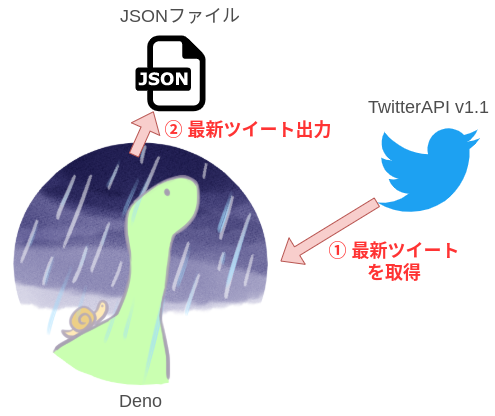
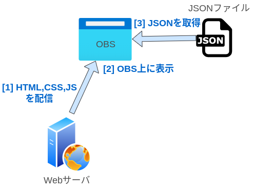
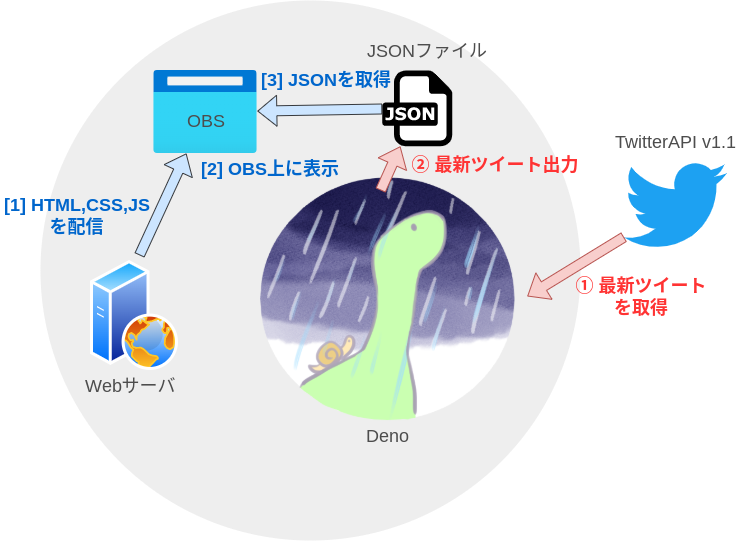

<!-- _header: - -->
daisyUIについて
===


Tailwind CSSベースのコンポーネントライブラリ！で開発を高速化！

###### 虎の穴ラボ 古賀広隆 ([@kght6123][twitter])

[twitter]: https://twitter.com/kght6123
[github]: https://github.com/kght6123

---

## 自己紹介
古賀 広隆（@kght6123）
[Twitter][twitter]/[Github][github]

とらのあな通販のコスト削減関連の開発に携わっています。2児の父です。

フロントエンド、サーバサイドが主な担当です。


---

# あじぇんだ！

1. [daisyUI](https://daisyui.com/)とは？
2. クリーンなHTMLになる
3. 細かいカスタマイズができる
4. テーマが使える
4. オススメのコンポーネント
5. 最後に（気軽に試せる https://daisyui.com/tailwindplay）


---

## 1. daisyUIとは？

Tailwind CSSのコンポーネントライブラリ（プラグイン）
UIの構築が楽になります。

- HTMLをきれいに保てる
- テーマ（26種類）があり、カスタマイズもできる
- ピュアCSSのコンポーネント（45個）が使える


---

## 2. クリーンなHTMLになる

- コンポーネントレベルのクラスをTailwind CSSに追加
- ユーティリティクラスのみの長いCSSになりにくい

HTMLのコードが短くてすっきりしやすくなる


---

### ユーティリティクラスのみのボタン（例）

レスポンシブ、アニメーション、カーソル、疑似要素などさまざまなユーティリティを指定して、1つのボタンが作れる。

```html
<a class="inline-block px-4 py-3
    text-sm font-semibold text-center
    text-white uppercase transition
    duration-200 ease-in-out
    bg-indigo-600 rounded-md
    cursor-pointer
    hover:bg-indigo-700">Button</a>
<!-- 引用元: https://daisyui.com/ -->
```

---

### コンポーネントクラスのボタン（例）

コンポーネントクラスのみで、1つのボタンが作れる。
さらに、ユーティリティクラスを追加と、カスタマイズも可能です。
（詳細は後述）

```html
<a class="btn btn-primary">Button</a>
<!-- 引用元: https://daisyui.com/ -->
```

---

## 3. 細かいカスタマイズができる！

- Tailwind CSSのユーティリティクラスを使って、細かいカスタマイズができる。
- `@apply`にdaisyUIを使ってカスタムスタイルを追加できる。
- CSS変数を利用して、daisyUIのCSS変数をカスタマイズできる。

---

<!-- _header: - -->

### denoの処理

1. denoでTwitterAPIを使って最新のツイートを取得（ハッシュタグ等で検索）
2. 取得した最新ツイートをJSONファイルに出力

上記を一定時間毎に繰り返す、
バッチ的な役割。


---

<!-- _header: - -->

### HTML側の処理
1. WebサーバからOBS上に静的コンテンツファイル（HTMLやCSS、JS）を配信
2. JSのFetch-APIで最新ツイートを含むJSONを取得
3. HTML（OBS）上に表示



---

<!-- _header: - -->



<!-- _footer: - -->

---

### なぜ、この構成になったのか？
1. 前に使ったことあるCLIでTwitterのツイートを取得するツールを定期的に叩いて使おう
2. HTMLとか作った後にツールが見つからない！ことが判明（非公開になった？）
3. せっかくなので、Denoを使って簡易的に作ってみよう（イマココ）

DenoをAPIサーバにしても良かったかも？


---

## 4. 実際に作ってみたOBSの画面

---


---

## 5. さいごに！

今回、Denoを使ってみて

### 1. 使い慣れたJavaScriptのAPIや書き方が使えるのは、楽だった。
### 2. importの書き方はちょっと戸惑う。
### 3. 次も使える場面があれば、積極的に使ってみたいと感じました。

TwitterのAPIの実行回数上限には気をつけましょう！

---

# ご清聴、ありがとうございました！


---

# Appendix

---
oauth2-token.ts (1)
```typescript
import { encode, decode } from "https://deno.land/std/encoding/base64.ts";

const auth = encode(
  "TwitterのBasic認証キー"
);

console.log(auth);
```
---
oauth2-token.ts (2)
```typescript
const response = await fetch(`https://api.twitter.com/oauth2/token`, {
  method: "POST",
  headers: new Headers({
    Authorization: `Basic ${auth}`,
    "Content-Type": "application/x-www-form-urlencoded;charset=UTF-8",
  }),
  body: "grant_type=client_credentials",
});
const result = await response.json();
console.log(result, result.access_token);

await Deno.writeTextFile("./oauth2-token-result.json", JSON.stringify(result));
```
---
v11-tweets-search.ts (1)
```typescript
import { parse } from "https://deno.land/std@0.66.0/flags/mod.ts";

console.log(Deno.args);

const parsedArgs = parse(Deno.args);
console.log(parsedArgs);
console.log(parsedArgs.o);

const oauthTokenResult = JSON.parse(
  await Deno.readTextFile("./oauth2-token-result.json")
);
console.log(oauthTokenResult.access_token);
```
---
v11-tweets-search.ts (2)
```typescript
const params = new URLSearchParams({
  q: `#とらラボ #LT`, // #とらラボLTはNG、#LTはOK、たぶん、ハッシュタグ内に日本語と英語の混在がNG
  count: "5",
  lang: "ja",
  locale: "ja",
  result_type: "recent",
  // since_id: '',
});
```
---
v11-tweets-search.ts (3)
```typescript
const execute = async () => {
  const response = await fetch(
    `https://api.twitter.com/1.1/search/tweets.json?${params}`,
    {
      method: "GET",
      headers: new Headers({
        Authorization: `Bearer ${oauthTokenResult.access_token}`,
        "Content-Type": "application/json",
      }),
    }
  );
  const result = await response.json();
  console.log(result);
```
---
v11-tweets-search.ts (4)
```typescript
  await Deno.writeTextFile(
    `${parsedArgs.o ? parsedArgs.o : "."}/v11-tweets-search-result.json`,
    JSON.stringify(result)
  );
};
await execute();

if (parsedArgs.f) {
  setInterval(async () => {
    await execute();
  }, parsedArgs.f);
}

```
